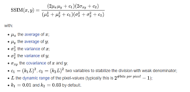

# Image-Enhancement-Project
This Git Repo is used for managing our Image Enhancement Project for a group assignment at FPT University.

# Training Process
For further detail, checkout [train_esrgan.ipynb](train_esrgan.ipynb). This process is based on the papers [ESRGAN: Enhanced Super-Resolution Generative Adversarial Networks](https://arxiv.org/abs/1809.00219) and [Real-ESRGAN: Training Real-World Blind Super-Resolution with Pure Synthetic Data](https://arxiv.org/abs/2107.10833).
## Constants
- EPOCHS = 10
- LR_SIZE = (96, 96)
- HR_SIZE = (384, 384)
- BATCH_SIZE = 4

## Model(s)

We are choosing [ESRGAN](https://arxiv.org/abs/1809.00219) as our model for Image Enhancement Project.
### Generator
- Overall Architecture

<a href="https://arxiv.org/pdf/1809.00219#page=5">
Figure 3 from ESRGAN paper
</a>

- Basic Block: RRDB (Residual in Residual Dense Block)

<a href="https://arxiv.org/pdf/1809.00219#page=5">
Figure 4 from ESRGAN paper
</a>

### Discriminator
We are using UNet as our discriminator. This is used in the paper [Real-ESRGAN](https://arxiv.org/abs/2107.10833).
- Overall Architecture

<a href="https://arxiv.org/pdf/2107.10833#page=5">
Figure 6 from Real-ESRGAN paper
</a>

## Loss Functions
### Discriminator Loss:

Where:
+ $`\mathbb{E}_{x_r}`$ is the
operation of taking average for all real data in the mini-batch. $`\mathbb{E}_{x_f}`$ is the operation of taking average for all fake data in the mini-batch.
+ $`D_{Ra}(x_r, x_f)=σ(C(x_r)−E_{x_f}[C(x_f)])`$ with $`σ(x)`$ is the Sigmoid Function and $`C(x)`$ is the non-transformed discriminator output.
### Generator Loss:

Where:
+ $`L_percep`$ is the Perceptual Loss calculated using pre-trained VGG19-54, where 54 indicates features obtained by the 4th convolution before the 5th maxpooling layer.
+ $`L_G^{Ra}`$ is the Generator Adversarial Loss

+ $L_1$ is the L1 Loss.
+ Parameter: $\lambda = 5 \times 10^{-3}$ and $\eta = 1 \times 10^{-2}$.
## Optimizers
We used Adam as optimizers for our models.
- Generator: learning_rate=2e-4, beta_1=0.9, beta_2=0.99
- Discriminator: learning_rate=1e-4

## Metrics
We used PSNR (Peak Signal to Noise Ratio) and SSIM (Structural Similarity Index Measure)
- PSNR:

- SSIM:

- MSE:

# Result
For further detail, checkout [train_esrgan.ipynb](train_esrgan.ipynb) and [test_model.ipynb](test_model.ipynb).

## Train Result
### Generator Loss

### Discriminator Loss

### PSNR

### SSIM 

## Demo Result

- PSNR = 21.770206451416016
- SSIM = 0.6498551964759827

